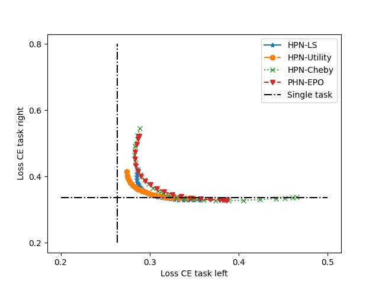
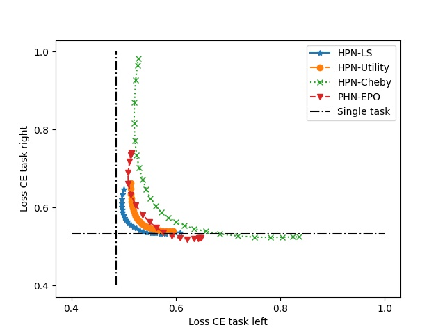
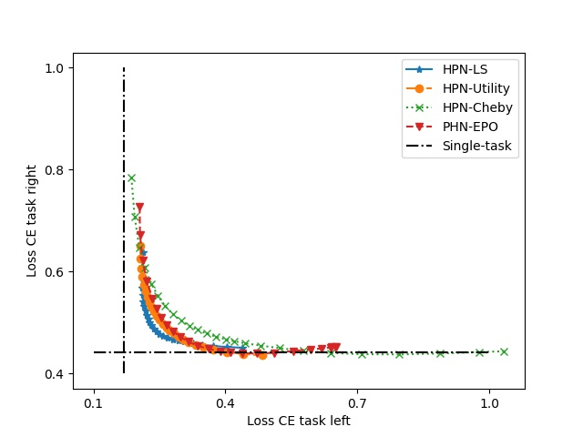

## Dataset
We use the data provided in [Pareto Multi-Task Learning](https://papers.nips.cc/paper/9374-pareto-multi-task-learning).
The data is available [here](https://drive.google.com/drive/folders/1d1OFgCT_pZIVpibyhlyZEc0Wc7Wf-uF0?usp=share_link).

Please create a `dataset` folder and download dataset.

## Results

### Hypervolume

We evaluate Hypervolume on 3 multi-task dataset including Multi-MNIST, Multi-Fashion, and Multi-Fashion+MNIST. We use a Linux server with Intel(R) Xeon(R), Silver 4216 64-bit CPU $@ 2.10$GHz, RAM 64GB, and VGA NVIDIA Tesla T4 16GB.

|    Method     |     Multi-MNIST       | Multi-Fashion | Multi-Fashion+MNIST 	|    Run-time (min.)
|:-------------:|:----------------:|:-----------------------------------:|:----------------------------------:|:------:|
|LS | 2.579  | 1.858  | 2.442  |  $13.5\times5 = \bf67.5$ | 
|EPO    | 2.870  | 2.173  | 2.751  | $40\times5 = 200$ | 
|PMTL  | 2.866  | 2.158  | 2.679  | $57\times5=285$ | 
|PHN-EPO| 2.866  |  2.203    |2.789| 75.5|
|HPN-LS ($\bf ours$)| 2.862| $\bf2.204$ |2.768|93.5|
|HPN-Utility ($\bf ours$)| $\bf2.874$|2.169|2.795|70|
|HPN-Cheby ($\bf ours$)|2.870|2.173|$\bf2.807$|72.5|

We also evaluate Hypervolume on multi-output dataset SARCOS. 

|    Method     |    SARCOS 	|    Run-time (min.)
|:-------------:|:----------------:|:------:|
|PHN-EPO| $\bf0.855$  | 103.5|
|HPN-LS ($\bf ours$)|0.850 |86.4|
|HPN-Utility ($\bf ours$)|0.846 |$\bf85.4$|
|HPN-Cheby ($\bf ours$)|0.828|98.4|

### Pareto fronts are generated by methods

<table>
  <tr>
    <td>Multi-MNIST </td>
     <td>Multi-Fashion</td>
     <td>Multi-Fashion+MNIST</td>
  </tr>
  <tr>
    <td></td>
    <td></td>
    <td></td>
  </tr>
 </table>
